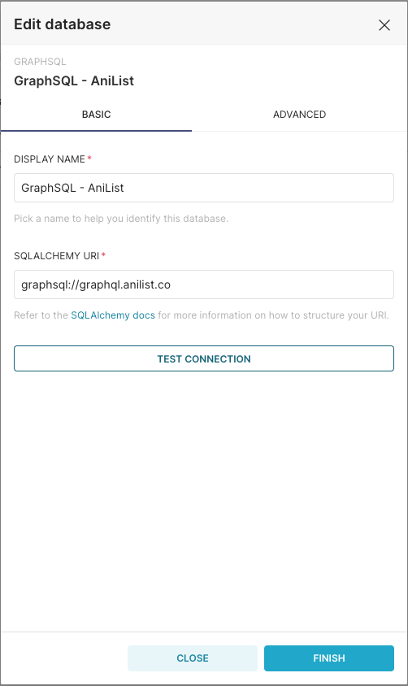
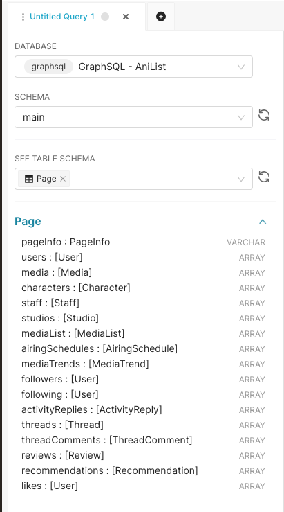
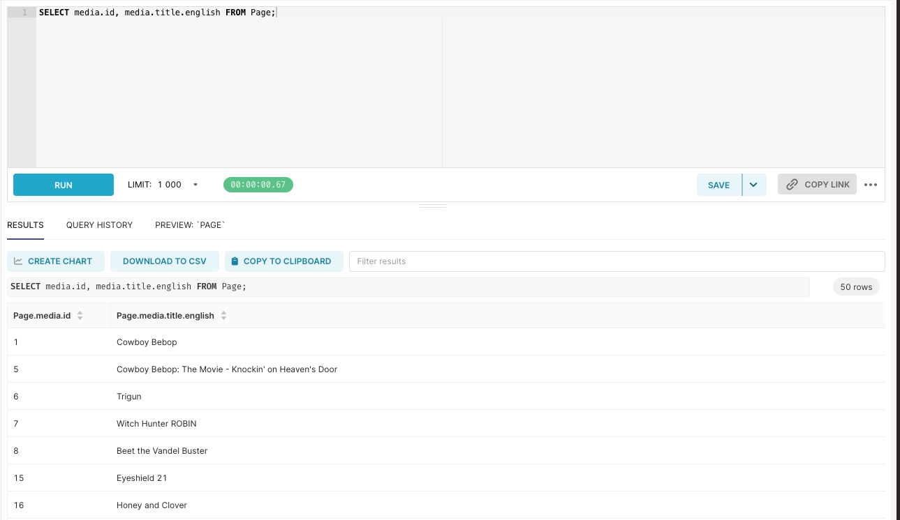
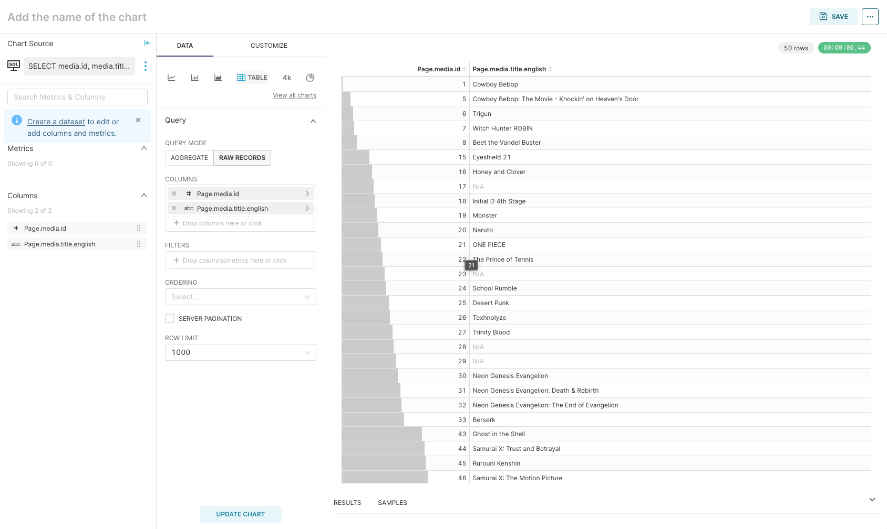

# GraphSQL

GraphSQL is a lightweight SQL-to-GraphQL connector designed to enable seamless querying of GraphQL endpoints using familiar SQL syntax. It aims to allow users to fetch, and analyze data from GraphQL APIs as if they were working with a relational database.

## 🚀 Features

- **SQL-Compatible Queries**: Write SQL queries that translate into GraphQL.
- **GraphQL Data Fetching**: Retrieve data from any GraphQL endpoint.
- **Live JSON-to-Tabular Conversion**: Convert GraphQL JSON responses into structured tabular formats (CSV, Parquet, JSONL).
- **Seamless Integration with SQLAlchemy**: Use GraphSQL as a SQLAlchemy dialect.
- **Superset Compatibility**: Connect GraphQL endpoints to Apache Superset for visualization.

## 📦 Installation

Requirements: Python 3.9+
For the experimental release, install directly from GitHub:

```sh
pip install git+https://github.com/AnthonyTlei/graphsql.git
```

## 🔧 Usage

### Python

```python
import graphsql.dialect.dialect
from sqlalchemy import create_engine, text
from sqlalchemy.dialects import registry
from sqlalchemy.engine.url import make_url

def test_graphsql_dialect():
    assert "graphsql" in registry.load("graphsql").name, "GraphSQL dialect is not registered!"
    print("✅ GraphSQL dialect is registered!")
    url = make_url("graphsql://graphql.anilist.co")
    engine = create_engine(url)
    assert engine.dialect.name == "graphsql", "Engine did not use the GraphSQL dialect!"
    print("✅ Engine created successfully with GraphSQL dialect!")
    with engine.connect() as conn:
        sql_query = text("SELECT media.id, media.title.english FROM Page")
        result = conn.execute(sql_query)
        rows = result.fetchall()
        print("✅ Query executed successfully!")
        print("Results:", rows)

if __name__ == "__main__":
    test_graphsql_dialect()
```

### Superset

1. Create a virtual_env

   ```bash
   python -m venv venv
   source venv/bin/activate
   ```

2. Install superset

   ```bash
   pip install apache-superset
   ```

3. Install GraphSQL

   ```bash
   pip install git+https://github.com/AnthonyTlei/graphsql.git
   ```

4. Environment variables

   ```bash
   export SUPERSET_SECRET_KEY=secret
   export FLASK_APP=superset
   ```

5. Init superset & User creation

   ```bash
   superset db upgrade
   superset fab create-admin
   ```

6. Start superset

   ```bash
   superset run -h 0.0.0.0 -p 8088 --with-threads --reload --debugger
   ```

7. Add a database, select Other and connect to endpoint using graphsql dialect

   e.g. graphsql://graphql.anilist.co
   (Here you can also specify connection type with is_http and auth arguments Basic or Bearer with url encoding)

   

8. Test the endpoint, navigate schema, tables, columns

   

9. Test a sample query

   

10. Test Chart creation

    

### 🌐 Handling HTTP Endpoints & Authentication

If your GraphQL endpoint uses HTTP instead of HTTPS, you need to set `is_http=1` when initializing the connection:

```python
url = make_url(endpoint="graphsql://your-graphql-endpoint.com?is_http=1")
```

To pass authentication arguments, use the `auth` parameter:

```python
url = make_url(endpoint="graphsql://your-graphql-endpoint.com?auth=<>")
```

## 🎯 Roadmap

- ✅ SQLAlchemy dialect support
- ✅ Superset compatibility
- ✅ Advanced introspection for schema validation
- ✅ Support for multi-line SQL
- ⏳ Support for more SQL features
- ⏳ Argument validation, filter, and conditional validation
- ⏳ Support for more Superset features
